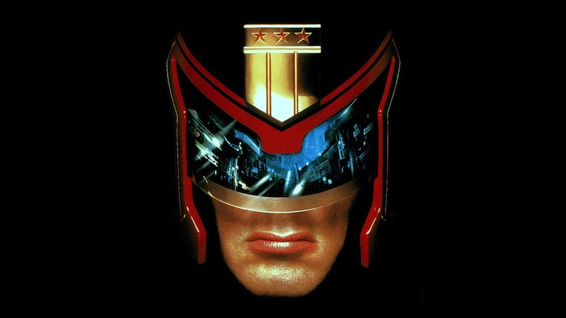

# Dredd    

*Contributor Licence Agreement Enforcer*

---

## About

When submitting pull requests to a component of [Cloud Foundry](https://github.com/cloudfoundry)
non-Pivotal employees are required to submit a CLA in order to have
their code merged.

This bot watches for incoming pull requests and checks to see if the
author has signed a CLA. If they have then it does nothing and goes on
its merry way. If they have not then it comments on the pull request to
let the author know what they have to do.

## Usage

1. Copy `config/config.example.yml` to `config/config.yml`.
2. Modify the options (GitHub credentials for the commenter, callback
   URL, callback secret, users to not comment on, and repositories to watch)
   in that file to taste. See the section below for more explanation as
   to what the different configuration variables are used for.
3. Push the application to your favourite application hosting service.
4. Rest easy knowing that Judge Dredd is fighting your legal battles for
   you.

### Configuration Variables

##### credentials.username

This is the GitHub username that you would like Dredd to use when
commenting on pull requests. It needs to be a user that has
administrative access to the repositories that you wish to monitor in
order to bootstrap the initial hooks. If you don't want to give Dredd
administrative access then for the moment just comment out the bootstrap
code in `config.ru` and create the hooks manually though the API (the
website doesn't give you enough options).

##### credentials.token

This is the token that Dredd uses in place of a password to authenticate
with GitHub. You can generate a new token by going to [this settings
page](https://github.com/settings/applications) for the username you
chose above and generating a new *Personal API Access Token*.

##### callback_url

This is the root URL that GitHub will post to when a new pull request is
made on any of your repositories. For example, if I was to push a Dredd
instance to Cloud Foundry with an application name of `dredd` then the
URL that I would put here would be `dredd.cfapps.io`.

##### callback_secret

This is the secret that GitHub and Dredd uses to make sure that any
requests sent to Dredd come from GitHub. You can choose any value for
this string but make sure to keep it secret. I'd advise making it some
nice random mess.

##### allowed_usernames

This is a explicit list of GitHub usernames that are allowed to create
pull requests without being asked to sign a CLA.

##### allowed_emails

This is a explicit list of email addresses that are allowed to create
pull requests without being asked to sign a CLA.

##### allowed_domains

This is a explicit list of email address domains that are allowed to
create pull requests without being asked to sign a CLA. For example, if
I want everyone with a `pivotallabs.com` email address to be whitelisted
then adding that to this list will do so.

##### allowed_organizations

This is a explicit list of github organizations that are allowed to
create pull requests without being asked to sign a CLA. For example, if
I want everyone who is a member of the `cloudfoundry` organization to
be whitelisted then adding that to this list will do so.

##### repositories

This is the list of GitHub repositories that Dredd will monitor for new
pull requests. It will create the required hooks on startup for any
repositories listed here. To stop listening for a particular repository
then manually remove the hook from the list on GitHub. The items in this
list are of the form `username/repository`.

##### enabled_actions

This is the list of pull request actions that will trigger Dredd to
start comment on pull request. See the full list of actions for
PullRequestEvent in [github API documentation](http://developer.github.com/v3/activity/events/types/#pullrequestevent).
If the list is empty Dredd will monitor all pull request actions.

#### skip_bootstrap

This is the flag that disables bootstrapping of github hooks. Set this
as `true` if Dredd does not have admin access to the GitHub repo and
hooks are already created.

#### non_whitelisted_template

This is the template Dredd will use to comment when the requester
does not exist in any whitelist.

#### whitelisted_template

This is the optional template Dredd will use to comment in the affirmative
when the requester already exists in the whitelist.

## License

    The MIT License (MIT)

    Copyright (c) 2013 Chris Brown

    Permission is hereby granted, free of charge, to any person
    obtaining a copy of this software and associated documentation files
    (the "Software"), to deal in the Software without restriction,
    including without limitation the rights to use, copy, modify, merge,
    publish, distribute, sublicense, and/or sell copies of the Software,
    and to permit persons to whom the Software is furnished to do so,
    subject to the following conditions:

    The above copyright notice and this permission notice shall be
    included in all copies or substantial portions of the Software.

    THE SOFTWARE IS PROVIDED "AS IS", WITHOUT WARRANTY OF ANY KIND,
    EXPRESS OR IMPLIED, INCLUDING BUT NOT LIMITED TO THE WARRANTIES OF
    MERCHANTABILITY, FITNESS FOR A PARTICULAR PURPOSE AND
    NONINFRINGEMENT. IN NO EVENT SHALL THE AUTHORS OR COPYRIGHT HOLDERS
    BE LIABLE FOR ANY CLAIM, DAMAGES OR OTHER LIABILITY, WHETHER IN AN
    ACTION OF CONTRACT, TORT OR OTHERWISE, ARISING FROM, OUT OF OR IN
    CONNECTION WITH THE SOFTWARE OR THE USE OR OTHER DEALINGS IN THE
    SOFTWARE.

---
